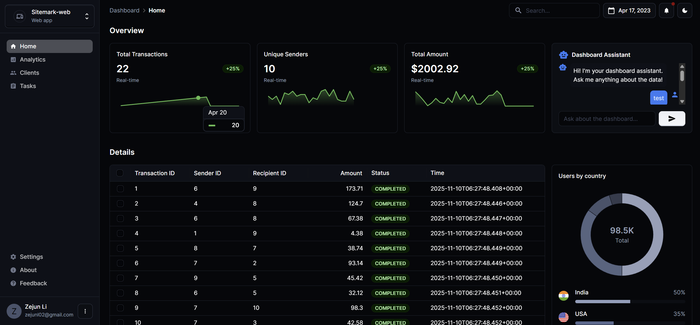

# Midas Core

Midas Core is a robust financial transaction processing system built as part of the JPMC Advanced Software Engineering Forage program. The system handles receiving, validating, and recording financial transactions with a modern web dashboard for monitoring.

## Features

- Real-time transaction processing
- Persistent transaction storage using H2 database
- RESTful API endpoints for transaction data
- Modern React dashboard for transaction monitoring
- Test data support for development
- Kafka for handling incoming messages

## Tech Stack

### Backend
- Java 17
- Spring Boot
- H2 Database
- Maven
- Kafka
- REST API

### Frontend
- React
- TypeScript
- Vite
- Material-UI (MUI)

## Getting Started

### Prerequisites

- Java 17 or higher
- Node.js 16 or higher
- Maven 3.6 or higher

### Installation

1. Clone the repository:
   ```bash
   git clone https://github.com/Jun7i/forage-midas.git
   cd forage-midas
   ```

2. Build and run the backend:
   ```bash
   ./mvnw clean install
   ./mvnw spring-boot:run
   ```
   The backend will start on http://localhost:8081

3. Install and run the frontend:
   ```bash
   cd frontend
   npm install
   npm run dev
   ```
   The frontend will start on http://localhost:5173

## Project Structure

```
├── src/                    # Backend source files
│   ├── main/
│   │   ├── java/          # Java source code
│   │   └── resources/     # Application properties and resources
│   └── test/              # Test files and test data
├── frontend/              # Frontend React application
│   ├── src/              # React source code
│   └── public/           # Static assets
└── pom.xml               # Maven configuration
```

## API Endpoints

- `GET /transactions` - Retrieve all transactions
- `GET /balance` - Get current balance information

## Development

The application includes a test data loader that automatically populates the database with sample transactions on startup. This allows for development and testing without requiring external dependencies.

To view the transactions:
1. Start the backend server
2. Visit http://localhost:8081/transactions in your browser or use the dashboard

## Contributing

1. Fork the repository
2. Create your feature branch (`git checkout -b feature/amazing-feature`)
3. Commit your changes (`git commit -m 'Add some amazing feature'`)
4. Push to the branch (`git push origin feature/amazing-feature`)
5. Open a Pull Request

## Original Project Description
Your team has been asked to build out the Midas system, a high-profile, 
high-stakes project which is sure to attract the right kind of attention if you can pull it off. 
In other words, doing well on this project would be an excellent career move. 
The Midas system architecture has already been nailed down, and tasking has been distributed to the various members of your team. 
You will be working on Midas Core - the component which receives, validates, and records financial transactions. 
This component depends on quite a few external resources - Kafka to receive new transactions, 
a SQL database to record and validate them, and a REST API to incentivize them. 
Your job over the course of this program will be to integrate all of these disparate resources into the final system.

One of your teammates has already put together a scaffold for the project according to the proposed system architecture. 
They managed to define a few classes, but otherwise, the codebase is quite bare. 
Midas Core uses Spring Boot, which should make the job of integrating external resources far easier than it would be with vanilla Java. Spring Boot - an extension of Spring - provides your application with a robust Dependency Injection framework, and takes care of much of the boilerplate associated with connecting your application to external dependencies. 
Spring Boot adopts a somewhat opinionated view of how your application should communicate with the aforementioned resources, 
but in this case, that’s a good thing - it saves us quite a bit of time wiring everything together. 
Your first task is to get your local development environment set up, 
familiarize yourself with the codebase, 
and make some last-minute preparations before you begin work on the project in earnest.